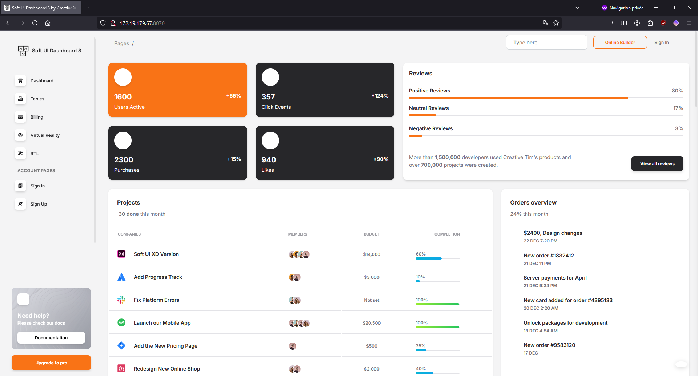
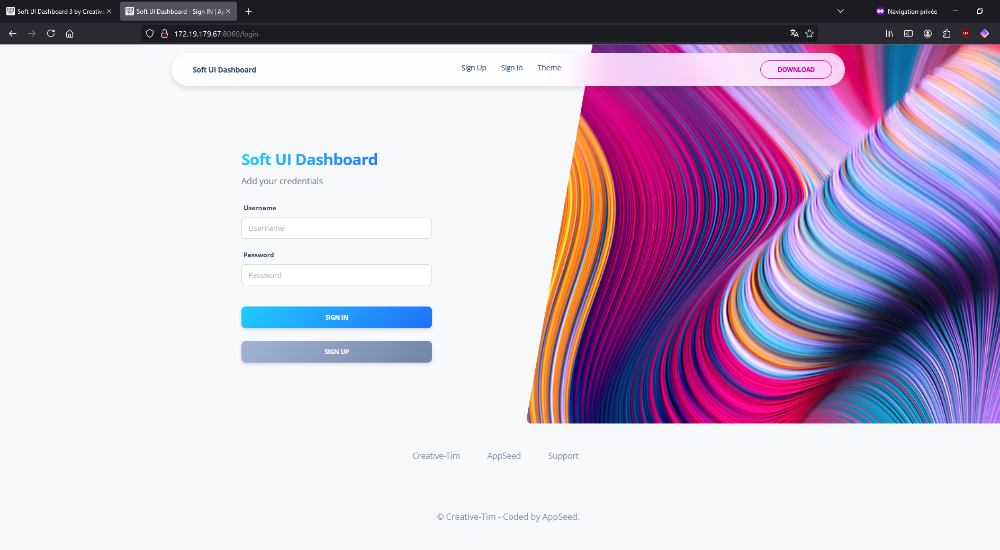
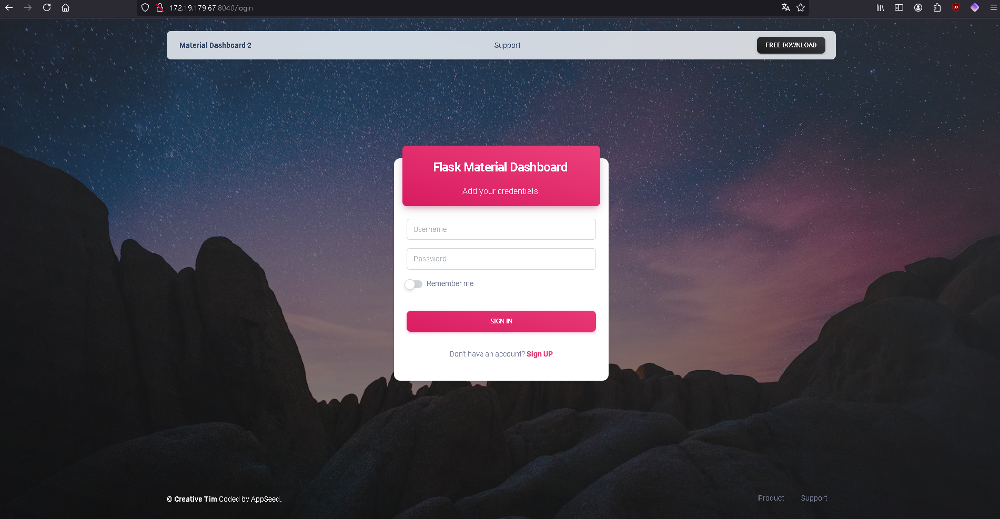

# E5-CISSP
Zenner-Gibeaux Geoffrey Rendu


<!-- PROJECT LOGO --> <br /> <div align="center"> <h3 align="center">Projet Docker : Applications Web</h3> <p align="center"> 
<a href="https://github.com/app-generator/django-soft-ui-dashboard"><strong>Documentation Django Soft UI Dashboard </strong></a> <br /> 
<a href="https://github.com/app-generator/flask-soft-ui-design">Documentation Flask Soft UI Design</a> · 
<a href="https://github.com/app-generator/ecommerce-flask-stripe">Documentation Ecommerce Flask Stripe</a> · 
<a href="https://github.com/app-generator/flask-material-dashboard.git">Documentation Flask Material DashBoard</a> </p> </div>

<!-- TABLE OF CONTENTS --> <details> <summary>Table des matières</summary> <ol> <li><a href="#structure-du-projet">Structure du projet</a></li> <li><a href="#configurations">Configurations</a></li> 
<li><a href="#etape-du-build">Étape du build</a></li> <li><a href="#logs">Logs</a></li> <li><a href="#quelques-interfaces">Quelques Interfaces</a></li> </ol> </details>


<!-- ABOUT THE PROJECT -->
## Struture du projet

Voici la structure du projet:

```bash
< PROJECT ROOT >
   |
   |-- apps/
   |    |-- django-soft-ui-dashboard/
   |    |-- flask-soft-ui-design/
   |    |-- ecommerce-flask-stripe/
   |    |-- rocket-django/
   |
   |-- nginx/
   |    |-- nginx.conf
   |
   |-- docker-compose.yml
   ************************************************************************
```


<p align="right">(<a href="#readme-top">back to top</a>)</p>


. Contenu du docker-compose.yml

``` bash
ersion: '3.7'

services:
  django-soft-ui:
    # build: ./django-soft-ui-dashboard
    image: th0m8s/django-soft-ui-dashboard:prod
    ports:     
      - "5080:5005"
    networks:
      - app_network

  flask-soft-ui:
    # build: ./apps/flask-soft-ui-design
    image: th0m8s/flask-soft-ui-dashboard:prod
    ports: 
      - "5083:5008"
    networks:
      - app_network

  flask-material-dashboard:
    # build: ./apps/ecommerce-flask-stripe
    image: th0m8s/flask-material-dashboard:prod
    ports:
      - "5082:5007"
    networks:
      - app_network

  flask-atlantis-dark:
    # build: ./apps/rocket-django
    image: th0m8s/flask-atlantis-dark:prod
    ports:      
      - "5081:5006"
    networks:
      - app_network

  nginx:
    image: "nginx:mainline-alpine3.20-slim"
    ports:      
      - "5080:5005"
      - "5081:5006"
      - "5082:5007"
      - "5083:5008"
    volumes:
      - ./nginx:/etc/nginx/conf.d
    networks:
      - web_network
    depends_on:
      - django-soft-ui
      - flask-soft-ui
      - flask-material-dashboard
      - flask-atlantis-dark

networks:
  app_network:
    driver: bridge
  web_network:
    driver: bridge

```

<!-- GETTING STARTED -->
## Etape du build

### Pour déployer les applications:

1- Exécuter la commande suivante pour mettre en place vos application:

``` bash
docker compose up -d
```

2- Après le build, tapez les commandes suivantes:

``` bash
docker images
docker ps
```

. Screen présentant les images


``` bash
docker ps
```
ou
``` bash
docker ps -a
```
. Screen présentant les conteneurs en cours d'exécution (a update)


Testez vos applications en local sur les ports suivants: ( a update) 
  <ul>
    <li><a href="#http://localhost:5080">http://localhost:5080</a></li>
    <li><a href="#http://localhost:5081">http://localhost:5081</a></li>
    <li><a href="#http://localhost:5082">http://localhost:5082</a></li>
    <li><a href="#http://localhost:5083">http://localhost:5083</a></li>


  </ul>

4- Pushez vos images sur le docker hub

. Connectez vous au docker hub:

``` bash
docker login
```

. Déplacer dans le répertoire de l'application pour exécuter les commandes suivantes:
``` bash
cd  nom_application
```

``` bash
docker build -t nom_image:tag_name .
```

``` bash
docker tag nom_image:tag: your_username/nom_image:tag_name_for_hub
```

``` bash
docker push your_username/nom_image:tag_name_for_hub
```


. Screen présentant les logs obtenus lors d'un push (a update)


. Docker Hub repositories (a update)


<p align="right">(<a href="#readme-top">back to top</a>)</p>


<!-- INTERFACES -->
## Quelques interfaces

. Soft UI Dashboard3



. Soft UI Dashboard



. Flask Materiaal Dashboard




## Choix des frameworks


Flask Soft UI Design

Léger et facile à utiliser.
Fournit une interface utilisateur moderne et personnalisable.

Ecommerce Flask Stripe

Simplifie l'intégration des paiements avec Stripe.
Idéal pour les projets de commerce électronique.

## Diagramme Projet


